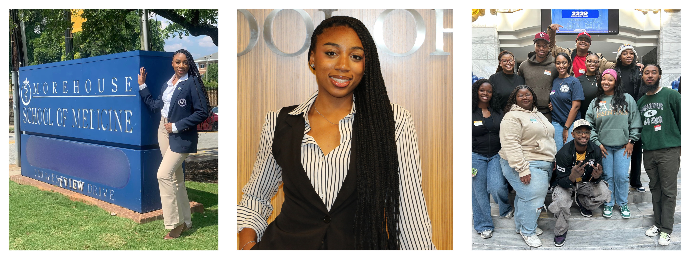
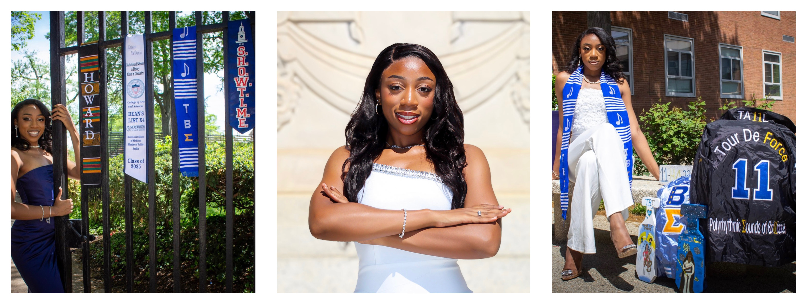

Currently, I am a second year Master of Public Health at Morehouse School of Medicine with a focus in biostatistics and epidemiology. After earning my Bachelor of Science in Biology at Howard University, I have continued to pursue opportunities to refine my skills and broaden my understanding of health disparities, preparing me to pursue a career that integrates clinical care and public health advocacy.

I am particularly interested in community development and engagement, drafting and implementing health policies, and researching disparities to design impactful interventions. Growing up as a Black woman in a predominantly Black community, I have witnessed the profound impact of health inequities, including limited access to resources, disparities in care quality, and targeted marketing of harmful products like tobacco and alcohol. Such challenges underscore the pressing need for systemic change to address the socioeconomic determinants that disproportionately affect minority groups, particularly the Black community.

Proficient in R/RStudio, SAS 9.4, Python, SQL, and GIS with experience in epidemiologic and biostatistical data analysis, data cleaning and management, statistical modeling, data visualization, and research methods. Skilled in applying regression analysis, ANOVA, machine learning, and epidemiologic methods to analyze public health data. Experienced with NHANES, BRFSS, and other health datasets, as well as communicating findings through reports, presentations, and data visualizations.

